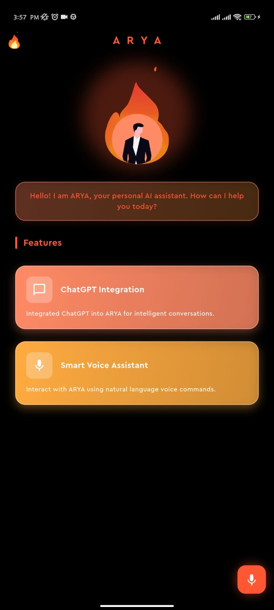

<div align="center">

# 🔥 A.R.Y.A - Adaptive Real-time Yielding Assistant

**A cutting-edge AI-powered voice assistant built with Flutter, featuring real-time speech recognition, OpenRouter AI integration, and natural text-to-speech capabilities.**

[Features](#-features) •
[Demo](#-demo) •
[Installation](#-installation) •
[Usage](#-usage) •
[Architecture](#-architecture) •
[Contributing](#-contributing) •
[License](#-license)

</div>

---

## 📱 Screenshots

<div align="center">
  
</div>

---

## 🎥 Demo

### Video Demonstration

[Watch the demo video here](https://github.com/user-attachments/assets/14619f78-68c2-48f1-8b42-e3cfe967fd81)

---

## ✨ Features

### 🎤 **Voice Recognition**

- Real-time speech-to-text conversion
- Automatic pause detection (3 seconds of silence)
- Visual feedback during listening

### 🤖 **AI Integration**

- Powered by **OpenRouter AI** (gpt-oss-20b)
- Custom personality training (ARYA identity)
- Context-aware responses
- Automatic response generation

### 🔊 **Text-to-Speech**

- Natural voice output
- Automatic response playback
- Manual replay option

### 🎨 **Modern UI/UX**

- Futuristic orange theme
- Smooth Lottie animations
- Glassmorphism effects
- Responsive design
- Material Design 3

---

## 🚀 Getting Started

### Prerequisites

- **Flutter SDK**: 3.8.1 or higher
- **Dart SDK**: 3.8.1 or higher
- **OpenRouter API Key**: Get one at [openrouter.ai](https://openrouter.ai)
- **Android Studio** / **Xcode** (for mobile development)

### Installation

1. **Clone the repository**

```bash
git clone https://github.com/4bhisheksharma/A.R.Y.A.git
cd arya
```

2. **Install dependencies**

```bash
flutter pub get
```

3. **Set up environment variables**

Create a `.env` file in the root directory:

```bash
cp .env.example .env
```

Edit `.env` and add your credentials:

```env
OPENROUTER_API_KEY=your_openrouter_api_key_here
SITE_URL=https://github.com/4bhisheksharma/A.R.Y.A
SITE_NAME=A.R.Y.A
```

4. **Run the app**

```bash
# For development
flutter run

# For release (Android)
flutter build apk --release

# For release (iOS)
flutter build ios --release
```

---

## 📖 Usage

### Basic Workflow

1. **Launch the app** - Open A.R.Y.A on your device
2. **Tap the microphone** - Start voice recognition
3. **Speak your question** - Ask anything you want
4. **Wait for response** - ARYA processes and responds
5. **Listen to answer** - Audio response plays automatically
6. **Replay if needed** - Tap the speaker icon to replay

### Voice Commands Examples

```
"What is the weather today?"
"Tell me a joke"
"Who are you?"
"What can you do?"
"Explain quantum physics in simple terms"
```

### Tips for Best Experience

- 🎤 Speak clearly and at a normal pace
- 📱 Ensure microphone permissions are granted
- 🌐 Have a stable internet connection
- 🔇 Use in a quiet environment for better recognition

---

## 🏗️ Architecture

### Project Structure

```
arya/
├── lib/
│   ├── screens/
│   │   └── home_screen.dart       # Main UI screen
│   ├── services/
│   │   └── openai_service.dart    # OpenRouter API integration
│   ├── widgets/
│   │   └── feature_box.dart       # Reusable feature card widget
│   ├── theme/
│   │   └── app_theme.dart         # App-wide theme configuration
│   ├── app.dart                   # App root widget
│   ├── app_view.dart              # MaterialApp configuration
│   └── main.dart                  # Entry point
├── assets/
│   ├── images/                    # Images and Lottie animations
│   ├── audios/                    # Audio files
│   └── fonts/                     # Custom fonts (Cera Pro)
├── android/                       # Android-specific files
├── ios/                          # iOS-specific files
├── .env                          # Environment variables (not tracked)
└── pubspec.yaml                  # Dependencies and assets
```

### Key Components

#### 1. **Home Screen** (`lib/screens/home_screen.dart`)

- Manages speech recognition state
- Handles AI API calls
- Controls text-to-speech output
- Displays UI components

#### 2. **OpenAI Service** (`lib/services/openai_service.dart`)

- OpenRouter API integration
- System prompt configuration
- Error handling
- Response parsing

#### 3. **App Theme** (`lib/theme/app_theme.dart`)

- Futuristic orange color scheme
- Consistent styling across app
- Material Design 3 support

#### 4. **Feature Box Widget** (`lib/widgets/feature_box.dart`)

- Reusable card component
- Gradient backgrounds
- Icon support
- Glassmorphism effects

---

## 🛠️ Technologies Used

### **Frontend**

- **Flutter** - Cross-platform UI framework
- **Material Design 3** - Modern design system
- **Lottie** - Vector animations

### **Backend/API**

- **OpenRouter API** - AI model access
- **HTTP** - API communication

### **Features**

- **speech_to_text** - Voice recognition (v7.3.0)
- **flutter_tts** - Text-to-speech (v4.2.0)

---

## 📦 Dependencies

```yaml
dependencies:
  flutter:
    sdk: flutter
  cupertino_icons: ^1.0.8
  lottie: ^3.3.1 # Animations
  speech_to_text: ^7.3.0 # Voice recognition
  flutter_dotenv: ^6.0.0 # Environment variables
  http: ^1.5.0 # API requests
  flutter_tts: ^4.2.0 # Text-to-speech

dev_dependencies:
  flutter_test:
    sdk: flutter
  flutter_lints: ^5.0.0 # Code analysis
```

---

## ⚙️ Configuration

### OpenRouter API Setup

1. Sign up at [openrouter.ai](https://openrouter.ai)
2. Create an API key
3. Add to `.env` file
4. Model used: `openai/gpt-4o-mini-2024-07-18`

### Customizing ARYA's Personality

Edit `lib/services/openai_service.dart`:

```dart
final String systemPrompt = '''
You are ARYA (Adaptive Real-time Yielding Assistant)...
// Customize AI personality here
''';
```

### Theme Customization

Edit `lib/theme/app_theme.dart`:

```dart
static const Color mainFontColor = Color.fromRGBO(255, 87, 51, 1);
// Modify colors here
```

---

## 🎨 Color Palette

| Color Name | Hex Code    | Usage                 |
| ---------- | ----------- | --------------------- |
| Main Font  | `#FF5733`   | Primary text, borders |
| First Box  | `#FF8A65`   | Feature cards         |
| Second Box | `#FFAB40`   | Feature cards         |
| Third Box  | `#FF9843`   | Accents               |
| Border     | `#FF8A6580` | Borders (50% opacity) |

---

## 🤝 Contributing

Contributions are welcome! Please follow these steps:

1. Fork the repository
2. Create your feature branch (`git checkout -b feature/AmazingFeature`)
3. Commit your changes (`git commit -m 'Add some AmazingFeature'`)
4. Push to the branch (`git push origin feature/AmazingFeature`)
5. Open a Pull Request


---

## 📄 License

This project is not opensource however you can use it by informing.

---

## 👨‍💻 Author

**Abhishek Sharma**

- Website: [abhishek-sharma.com.np](https://abhishek-sharma.com.np)
- GitHub: [@4bhisheksharma](https://github.com/4bhisheksharma)
- LinkedIn: [Abhishek Sharma](https://linkedin.com/in/4bhisheksharma)

---


## ⭐ Show Your Support

If you like this project, please give it a ⭐ on GitHub!

---

<div align="center">

**Made with ❤️ and Flutter**

© 2025 Abhishek Sharma. All rights reserved.

</div>
